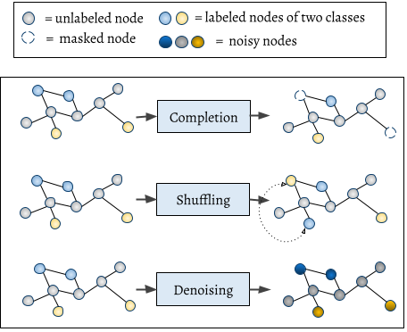

# SSL_graph_audio

<br>

**Nov 04, 2022**
* First release of the project.

<br>



It is the implementation of "Self-supervised Graphs for Audio Representation Learning with Limited Labeled Data" paper.

Graph SSL task Library for PyTorch Geometric.

---

## Installation

You can also install the library from source:

```
$ git clone https://github.com/AmirSh15/SSL_graph_audio
$ cd SSL_graph_audio
$ pip install -e .
```

#### Dependencies
```
torch==1.10.2
torch_geometric==2.0.3
```
---

## Usage
The library comes with the following SSL tasks:

| SSL                          | Remarks                                         | When to use             |
|------------------------------|-------------------------------------------------|-------------------------|
| `Completion(p=0.05)`         | Randomly masks node features with the given `p`         | before, during training |
| `Shuffling(p=0.05)`          | Randomly drops edges with the given `p`         | before, during training |
| `Denoising(p=0.05)`          | Randomly adds gaussian noise with the given `p`  | before training,  during training       |


```python
from torch_geometric.datasets import CoraFull
import SSL_graph_audio.transforms as T

node_aug = T.Compose([
    T.Completion(p=0.45),
    T.Denoising(p=0.5),
])

edge_aug = T.Compose([
    T.Shuffling(p=0.15),
])

data = CoraFull('./')

for epoch in range(10):  # begin training loop
    new_data = node_aug(data.data)  # apply the node SSL task(s)
    new_data = edge_aug(new_data)  # apply the edge task(s)

    x, y = new_data.x, new_data.y
```

---

## Reference 

[ArXiv's paper](https://arxiv.org/pdf/2202.00097) | [IEEE paper](https://ieeexplore.ieee.org/document/9830587)
```
@article{9830587,
  author={Shirian, Amir and Somandepalli, Krishna and Guha, Tanaya},
  journal={IEEE Journal of Selected Topics in Signal Processing}, 
  title={Self-Supervised Graphs for Audio Representation Learning With Limited Labeled Data}, 
  year={2022},
  volume={16},
  number={6},
  pages={1391-1401},
  doi={10.1109/JSTSP.2022.3190083}}
```